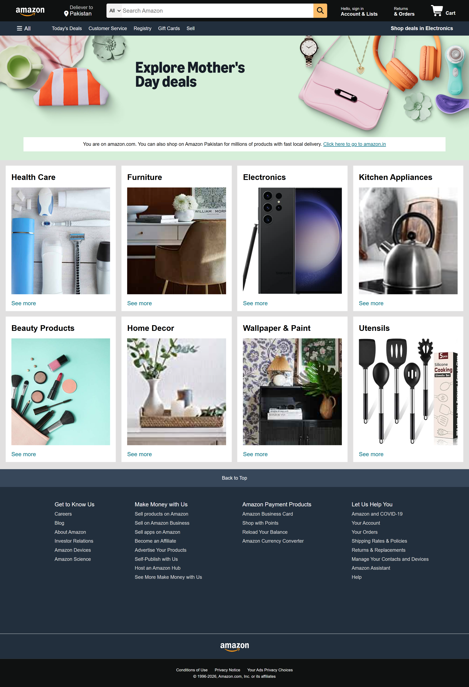

# 🛒 Amazon Homepage Clone

A modern **Amazon Homepage Clone** built using **HTML5** and **CSS3**. This project recreates the look and feel of Amazon's homepage, featuring a navigation bar, search section, hero banner, product categories, and a multi-column footer. It was developed to strengthen frontend development skills by practicing real-world website cloning techniques.

## ✨ Features

- 🛍️ Amazon-inspired homepage design
- 🧭 Navigation bar with logo and menu
- 🔍 Search bar interface
- 🖼️ Hero banner section
- 📦 Product category cards
- 🛒 Shopping cart icon
- 📂 Multi-column footer
- 🎨 Clean and organized layout
- 💻 Built with semantic HTML5 and CSS3
- 🌐 Cross-browser compatible

## 🛠️ Technologies Used

- HTML5
- CSS3

## 📸 Preview

## 🚀 Live Demo

🌐 **Live Website:**  

## 📚 What I Learned

Through these projects, I improved my understanding of:

- Semantic HTML5 structure
- CSS Flexbox
- CSS Grid
- Website layout design
- Navigation bar creation
- Product card layouts
- Typography and spacing
- Image positioning
- E-commerce homepage design
- Website cloning techniques

## 👩‍💻 Author

**Mazia Ramzan**  
**Frontend Web Developer**

- GitHub: https://github.com/maziaramzan80
- LinkedIn: https://www.linkedin.com/in/mazia-ramzan-8aa7b4342?utm_source=share_via&utm_content=profile&utm_medium=member_android
- Instagram: https://www.instagram.com/web_canvas_?igsh=eXppZ2FjbWsweDlo

## ⭐ Support

If you found this project helpful or inspiring, please consider giving it a **⭐ Star** on GitHub. Your support motivates me to continue building more frontend development projects.
